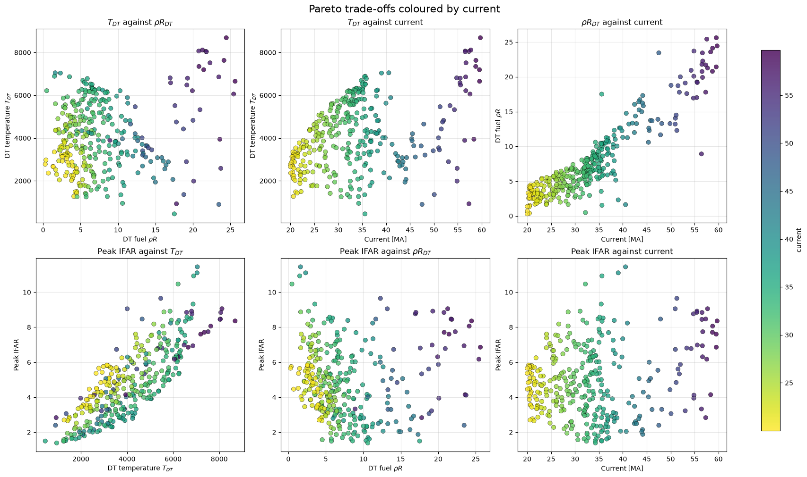

# Iceburner: Pareto Analysis of a Magnetized-Liner DT-Ice Capsule Design

## Research question

The Gorgon "iceburner" campaign runs multi-objective Bayesian optimisation
(MOBO) over a magnetized-liner ICF capsule design: a beryllium liner
enclosing a DT ice fuel layer, imploded by a pulsed-power drive current
and augmented by laser preheat. The design space is six dimensionless
multipliers (`f_laser`, `f_R_outer`, `f_Pi`, `f_Be`, `f_rho`, `current`)
applied on top of a similarity-scaled reference design.

**This repository asks: across that design space, which designs are
Pareto-optimal when simultaneously maximising DT fuel temperature
(`T_DT`), areal density (`ρR_DT`), and implosion stability (`-peak
IFAR`), while minimising drive current — and how does DT ice-layer
thickness, a derived rather than directly controlled quantity, trade off
against them?**

## Main result figure



Across the 324-point observed Pareto front, drive current is the
dominant axis of variation: increasing current drives higher `T_DT` and
`ρR_DT` (top row), but also pushes peak IFAR up (bottom row) — i.e. the
implosion becomes less stable. No single design dominates on all four
objectives; the campaign's job is to characterise this trade-off surface,
not to collapse it to one point.

## Key findings

- **Current is the primary lever, and it's a genuine trade-off, not a free
  lunch.** `T_DT` and `ρR_DT` both increase with current, but so does
  peak IFAR (reduced stability) — see the main result figure above.
- **The observed 3-objective Pareto front is broad**, spanning `T_DT`
  from ~1000 to ~8700, `ρR_DT` from ~0 to ~26, and `-peak IFAR` from ~-14
  to 0 (`figures/pareto_front_3d.png`), meaning the campaign found
  meaningfully different operating regimes rather than a single cluster
  of similar designs.
- **MOBO sampling captured most of the achievable hypervolume early.**
  Cumulative hypervolume (`figures/hypervolume_history.png`) rises
  steeply over the first ~100 simulations and then plateaus, suggesting
  diminishing returns from continued sampling within this campaign's
  budget.
- **Fitting a surrogate on the raw, unfiltered database is unreliable for
  at least one objective**: `03_surrogate_scan.ipynb` (no filtering)
  produces 0/100 finite `ρR_DT` predictions across its R_outer scan,
  while `04_surrogate_scan_filtered.ipynb` (same scan, bad simulations
  removed first) does not. This is direct, reproducible evidence for why
  the filtering step in `iceburner.surrogate.filter_invalid_simulations`
  matters, not just a theoretical concern.

## Why the problem matters

Magnetized-liner inertial fusion (MagLIF-style) designs are driven by
large pulsed-power currents that compress and heat a DT-fuel-filled
liner. Getting a good burn requires simultaneously high fuel temperature
and areal density (for fusion yield) *and* a stable implosion (low peak
IFAR, since high in-flight aspect ratios amplify Rayleigh–Taylor-type
instabilities that can quench the burn). These objectives compete with
each other and with the practical cost of higher drive current, and each
data point costs a full Gorgon MHD simulation. Multi-objective Bayesian
optimisation, backed by a cheap surrogate for exploratory scans, is what
makes it tractable to map this trade-off space instead of hand-scanning
one parameter at a time.

## Methodology

1. **Simulate.** Gorgon MHD simulations of the capsule design, run across
   a 6D space of dimensionless multipliers on a similarity-scaled
   reference design (the scaling law and its exponents live in
   `iceburner/scaling.py`), driven by BoTorch-based MOBO plus
   random-sampling exploration, recorded in a sqlite database.
2. **Clean.** Filter simulations with non-finite or physically impossible
   objective values before any downstream analysis
   (`iceburner/database.py`, `iceburner/surrogate.py`).
3. **Characterise the optimisation.** Track cumulative hypervolume over
   the sampling history, and extract the non-dominated (Pareto) set via
   `botorch.utils.multi_objective.pareto.is_non_dominated`
   (`iceburner/pareto.py`).
4. **Reconstruct physics.** Convert the optimiser's dimensionless
   multipliers back into physical design values (liner radius, Be
   thickness, Π mass-loading, laser energy) and derive the DT ice-layer
   thickness from a Be/DT-ice mass balance (`iceburner/scaling.py`).
5. **Interpolate cheaply.** Fit a random-forest surrogate
   ([mille-feuille](https://github.com/aidancrilly/mille-feuille)) on
   the cleaned database and scan individual inputs (or the derived DT
   ice thickness) to see the surrogate's predicted response with
   uncertainty bands (`iceburner/surrogate.py`).

## Reproducing the results

```bash
git clone --recurse-submodules <this repo>
# or, if already cloned: git submodule update --init

conda create -n iceburner python=3.11
conda activate iceburner
pip install -e .                 # iceburner package + numpy/pandas/matplotlib/sklearn/torch/botorch
pip install -e mille-feuille      # the MOBO/surrogate library used by the surrogate notebooks
pip install -e ".[notebooks]"     # jupyter, if you want to run the notebooks
```

Run the notebooks from the `notebooks/` directory (they load data via a
relative `../data/...` path), in this order:

1. `01_database_and_pareto_analysis.ipynb` — loads the database, filters
   outliers, computes hypervolume history and the observed Pareto front,
   and writes `results/pareto_dominating_points.csv`.
2. `02_dt_ice_thickness_analysis.ipynb` — reads that CSV, reconstructs
   physical DT ice-layer geometry, and plots the Pareto trade-offs
   (source of the main result figure above).
3. `03_surrogate_scan.ipynb` — fits a random-forest surrogate on the raw
   database and scans one input.
4. `04_surrogate_scan_filtered.ipynb` — filters known-bad simulations
   before fitting the surrogate, then runs several input scans, including
   a derived DT ice-thickness scan.

## Repository structure

```
iceburner/          reusable analysis package (import this from notebooks or scripts)
    scaling.py       similarity-scaling physics + DT ice-geometry reconstruction
    database.py      load the sqlite simulation database, filter outlier rows
    pareto.py        hypervolume history, Pareto-front extraction/inspection, plots
    surrogate.py     clean a mille-feuille State, scan a fitted surrogate, plot predictions
notebooks/          thin notebooks that call into iceburner and display results
data/               simulation database(s)
results/            generated outputs (e.g. the Pareto-point CSV)
figures/            exported result figures referenced in this README
mille-feuille/      git submodule: MOBO/surrogate library (fork, branch MOBO)
```

`pareto.py` and `database.py`/`scaling.py` implement the analysis for
notebooks 01 and 02. `surrogate.py` implements the analysis for notebooks
03 and 04. All four notebooks used to duplicate this logic inline (with
small, silent divergences between copies); it now lives in one place.

## Tests and validation

There is no automated `pytest` suite yet (see Future work). What has been
checked:

- Every function in `iceburner/scaling.py` was numerically verified
  against the original, independent implementations from the four source
  notebooks (matching to floating-point precision on representative
  synthetic inputs) before those implementations were removed.
- `iceburner/database.py` was checked against the real database: 752 raw
  rows load correctly, 7 are flagged as outliers, 745 remain.
- All four notebooks were executed end-to-end, top to bottom, in a clean
  run against the real database and a real fitted mille-feuille
  surrogate, with no errors.
- Two real bugs in the pre-refactor notebooks were found and fixed during
  this process (see Limitations for details), rather than being silently
  carried forward.

## Limitations

- The similarity-scaling law (reference radii, Π parameter, laser
  energy, gas density, and their current-scaling exponents in
  `iceburner/scaling.py`) is only exercised over the sampled current
  range (~20–60 MA) in this database; extrapolating it outside that range
  is unvalidated.
- Two inconsistencies were found in the pre-refactor code while
  consolidating it, which means the analysis this repo is based on had
  not been independently cross-checked before:
  - A laser-energy scaling coefficient conflicted between two notebook
    copies (`0.84e3` vs `2.1e3`); `0.84e3` was kept as it was the value
    actually used in the Pareto-point inspection workflow.
  - `current_MA` in the DT-ice-thickness analysis was previously derived
    from a normalised objective without correcting for the
    normalisation, making it 20x too small everywhere it was used.
- The random-forest surrogate's uncertainty bands are ensemble spread,
  not a calibrated Bayesian posterior.
- The surrogate is fit on 745–746 simulations across a 6D input space;
  some regions of the design space are likely undersampled.
- All objectives come from a single MHD code (Gorgon) under its own
  modelling assumptions; nothing in this repository validates those
  simulations against experiment.

## Future work

- Add a `pytest` suite covering `iceburner/scaling.py`,
  `iceburner/database.py`, and the Pareto/surrogate logic.
- Extend the MOBO campaign with more samples, potentially using the
  fitted surrogate for active-learning-guided acquisition.
- Replace the random-forest ensemble spread with calibrated surrogate
  uncertainty (e.g. Gaussian-process regression via mille-feuille/BoTorch).
- Investigate the non-finite `ρR_DT` predictions from the unfiltered
  surrogate (`03_surrogate_scan.ipynb`) directly, rather than only
  working around them by filtering.
- Validate the similarity-scaling law against dedicated single-parameter
  Gorgon scans, since two undetected inconsistencies were already found
  in the derived-quantity code that depends on it.

## References

- Crilly, A. et al. *Automated simulation-based design via multi-fidelity
  active learning and optimisation for laser direct drive implosions*.
  <https://arxiv.org/abs/2508.20878>
- *Fusion alpha particle momentum deposition in thermonuclear burn
  dynamics*. <https://pubs.aip.org/aip/pop/article/33/5/050702/3388847/Fusion-alpha-particle-momentum-deposition-in>
- [mille-feuille](https://github.com/aidancrilly/mille-feuille) — MOBO/
  surrogate library used for the random-forest surrogate scans.
- [BoTorch](https://botorch.org/) — used for hypervolume computation and
  non-dominated (Pareto) set extraction.
